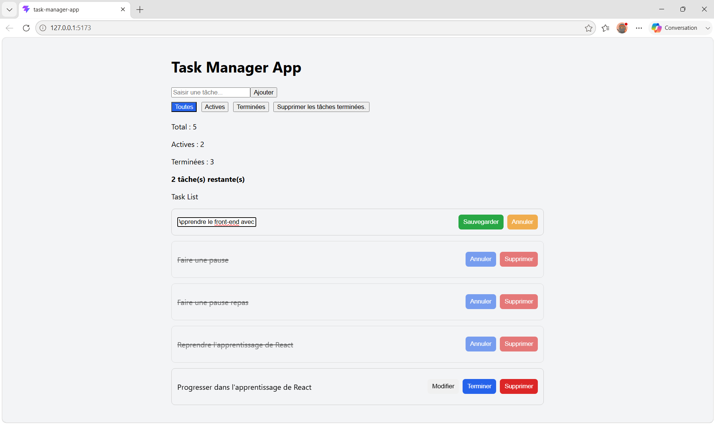

# React Task Manager App



A simple React task management application.

## Description

A task management application built with React that allows users to create,
edit, complete, delete and filter tasks. Tasks are automatically saved in Local Storage to preserve data between sessions.

## ✨ Features

- Create tasks
- Edit tasks
- Cancel task editing
- Delete tasks
- Complete tasks
- Reopen completed tasks
- Filter tasks (All / Active / Completed)
- Prevent duplicate tasks
- Validate user input
- Display validation error messages
- Automatically save tasks in LocalStorage
- Persist tasks between sessions
- Delete all completed tasks
- Display task statistics

## 🛠️ Technologies

- React
- Vite
- Javascript (ES6+)
- CSS3
- local Storage API
- Git
- GitHub
- EsLint
- Prettier

## 📚 What I Learned

During this project, I learned how to:

- Design a React application with a clear and maintainable component architecture.
- Design components by focusing on their single responsability.
- Improve code quality through code reviews and refactoring.
- Improve application reliability by validating user input and handling edge cases.

## 🚀 Getting Started

Follow these steps to run the project locally:

### Clone the repository

```bash
git clone https://github.com/kaziZawadi/task-manager-app.git
```

### Install dependencies

```bash
npm install
```

### Start the development server

```bash
npm run dev
```

## 📁 Project Structure

```text
src/
├── components/
│   ├── TaskCard.jsx
│   ├── TaskForm.jsx
│   └── TaskList.jsx
├── App.jsx
├── App.css
├── index.css
└── main.jsx
```
